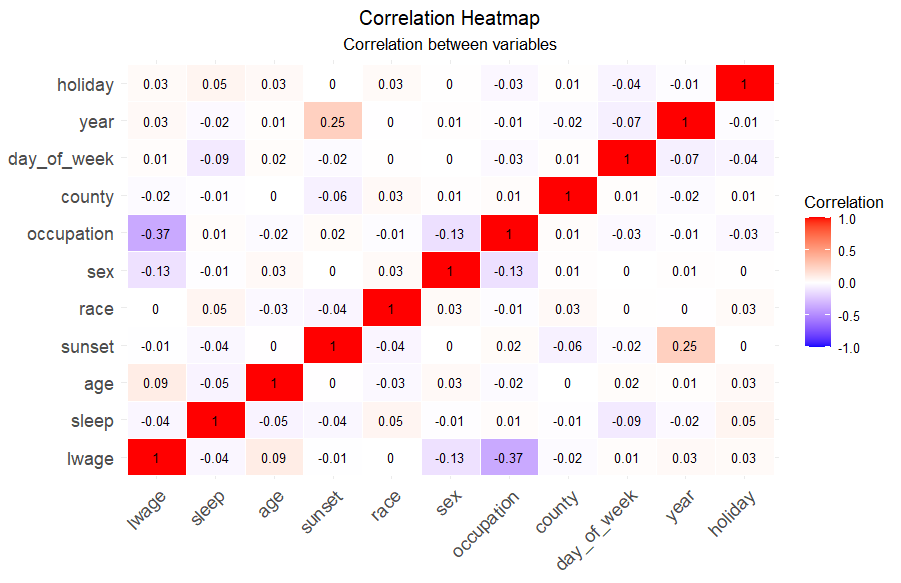
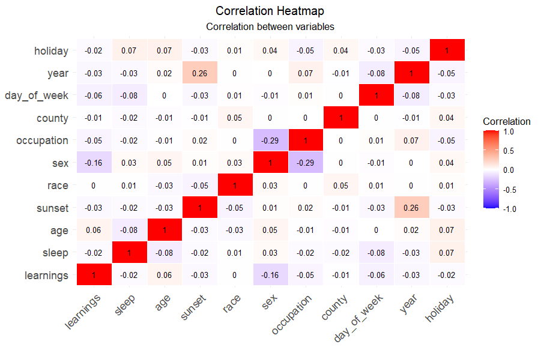

# Introduction

Sleep is the most frequent use of human time. For most of the twentieth
century, sleep had been overlooked by economists’ models of time-use
optimisation - something that has changed ever since Biddle and
Hamermesh (1990), an influential paper that suggested sleep affected
earnings through increased labor market productivity, implying sleep
time is a choice variable that be optimized by economic agents.

Our paper uses data from the 2022 version of the American Time Use
Survey (ATUS) to investigate the relationship between sleep time and
earnings in the United States. This investigation directly builds upon
the work of Gibson and Shrader (2018) who, using data from the ATUS,
found a positive causal relationship of sleep time on earnings. Gibson
and Shrader (p. 795) showed that a 1-hour increase in weekly mean sleep
significantly increases weekly earnings by 1.1% due to seasonal
variation and by as much as 5% due to geographical variation. The
returns to 1-hour of sleep found by Gibson and Shrader make it
comparable to the returns of 1-year increase in education
(Psacharopoulos and Patrinos, 2004), stressing the need to better
understand the mechanisms by which sleep can affect individual and
societal economic outcomes.

What differentiates our study from previous ones is that, to our
knowledge, it is the first attempt to establish a causal relationship
between sleep and earnings with data from later than 2019, meaning we
are potentially capturing any effects of the COVID-19 pandemic and its
aftermath on the relationship between the two variables. The pandemic
has affected how people sleep and work. Most studies show an increase in
sleep duration during the pandemic accompanied by reduced sleep quality
and altered sleep schedules (Neculicioiu *et al.*, 2022), making the
potential direction of the impact on worker productivity unclear. In
addition, the surge in remote work since COVID-19 has been observed to
cause a substantial jump in wage premia as well as faster wage growth
rates for remote workers (Pabilonia and Vernon, 2023). Increased wake-up
time flexibility, higher screen time and other factors associated with
remote work have been associated with changing sleeping patterns in
health care workers (Conroy *et al.*, 2021). This evidence suggests
potential changes in the sleep-earnings relationship, making it
interesting to investigate whether the effect measured by Gibson and
Shrader (2018) is still present and whether time effects such as the
pandemic have strengthened or broken down this relationship.

# Literature Survey

Scientific studies suggest detrimental effects of sleep deprivation on
worker productivity. While the lack of sleep among medical residency
students has been seen to induce clinical errors, symptoms of sleep
deprivation alone are responsible for approximately 4% of highway
accidents in the USA each year (Landrigan *et al.*, 2004; Knipling and
Wang, 1994). Implications of such evidence on worker performance in any
job setting are wide, especially since fatigue has been estimated to
generate costs up to 3% of the USA’s GDP every year (Hafner *et al.*,
2017). Previous research has found that employed people sleep less than
the non-employed, women sleep less than men, and there is a quadratic
relationship between age and sleep time (inverse U-shaped for men and
U-shaped for women) (Biddle and Hamermesh, 1990).

One of the main issues when exploring the relationship between sleep and
earnings is that of reverse causality. Historically, the literature has
focused on how sleep can be modelled as a function of wages and other
labour market variables and shocks like recessions (Biddle and
Hamermesh, 1990; Szalontai, 2006; Brochu *et al.*, 2011). A generally
accepted solution to get around the issue of collinearity has been to
instrument sleep time through local sunset time. The secretion of
melatonin, a hormone responsible for promoting deep sleep, is associated
with the decrease in natural light that comes after sunset (Roenneberg
*et al.*, 2007), making sunset time a relevant instrument for sleep
time. Moreover, Giuntella and Mazonna (2019) confirm the adverse effects
of sunset time on sleep duration of both employed and non-employed
individuals by conducting a regression discontinuity design and
exploiting time zone borders in the USA. Employed individuals on the
late sunset side of the border were more likely to be overweight and
exhibit poorer health in general due to circadian misalignment.

More recently, Costa-Font et al. (2024, p. 8) improved upon the pooled
cross-sectional analysis of Gibson and Shrader (2018) by looking at
panel data from Germany, finding that a 1-hour increase in weekly sleep
is associated with 3.4% increase in weekly earnings. Additionally, the
study also reveals that longer sleep duration reduces the unemployment
rate and improves labour force participation. Costa-Font et al. also
find that the premium of additional sleep was substantially greater for
parents, especially mothers, leaving room for potential policy
implications.

# Dataset

The American Time Use Survey (ATUS) undertaken by the U.S. Bureau of
Labour Statistics is a continuous survey measuring the division of time
among life activities by the US population. The respondents who
participate in ATUS are randomly selected from the most recent Current
Population Survey (CPS) and submit a time-use diary. CPS is conducted
using computer-assisted telephone interviewing, which according to the
U.S. Bureau of Labour Statistics, minimises clerical errors and improves
the accuracy of data collection relative to alternative methods.

To get the instrumental variable, sunset times for each observation, we
merged the two datasets, ATUS and CPS. For most of the observations, CPS
provides county-level information in the form of Federal Processing
Information Standards or FIPS code. For better precision in matching
sunset times with observations, we have decided to drop respondents with
only state-level locations (FIPS 5-2) and exclusively use county-level
locations (FIPS 6-4). By utilising FIPS codes and using the dimensions
of the counties, we calculate the latitude and longitude of each
county’s centroid at which the sunset times are calculated.

We treat sleep as an independent variable and consider individuals who
report sleeping between 2 to 16 hours on the diary day. The ideal sleep
time for cognitive function is between 6 to 9 hours. Lower or higher
sleep times are detrimental to cognitive function in adults (Tai *et
al.*, 2022). Therefore, we have decided to exclude the extreme
observations for legitimacy reasons.

In terms of dependent variables, we have opted to include weekly wages
and hourly earnings. Hours worked per week were used to get weekly
earnings. Additionally, we only include individuals with a positive
weekly wage or earnings. Data on weekly wage and hourly earnings were
taken from CPS after merging it with ATUS.

While some control variables, such as race (white, black, Asian and
other) had to be taken from CPS due to them not being available in ATUS,
our primary aim was to use variables reported in ATUS whenever possible.
Besides, individual controls include age, age squared, sex, and 23
occupational categories. Subsequently, we control for location-fixed
effects and time-fixed effects. Time-fixed effects include day of the
week, year and holidays. We have also excluded individuals who are
younger than 15 years of age to capture the working population. Lastly,
location-fixed effects are the categorical variables for the county in
which the individual resides.

<div id="tab:summary_stats">

|        | Unique |  Mean   |   SD   |   Min   | Median  |   Max   |
|:------:|:------:|:-------:|:------:|:-------:|:-------:|:-------:|
|  wage  |  1086  | 1196.7  | 587.0  |  346.1  | 1057.7  | 2692.3  |
| sleep  |  379   |  62.1   |  14.3  |  14.0   |  61.2   |  112.0  |
|  age   |   67   |  43.5   |  13.5  |  15.0   |  42.5   |  85.0   |
| agesq  |   67   | 2072.6  | 1236.2 |  225.0  | 1806.5  | 7225.0  |
| lwage  |  1086  |   7.0   |  0.5   |   5.8   |   7.0   |   7.9   |
| sunset |  3033  | 66035.9 | 3555.8 | 58174.0 | 66314.0 | 73731.0 |

Summary Statistics of Continuous Variables

</div>

# The Model

We ran two different second stage regressions, with two differing
dependent variables, which are the natural logarithm of wages and the
natural logarithm of earnings. The model accounts for many controls such
as age, location, race, gender, occupation and time controls.
``` math
\begin{gathered}
    T_{s, ijt} = \alpha \cdot sunset_{jt} + \sum_{j=1}^{254}\gamma_{j} \cdot location_j +\sum_{j=1}^{3}\delta_{1, j} \cdot race_j + \delta_2 \cdot age_{it} + \delta_3 \cdot age^2_{it} +\\ \delta_4 \cdot sex_{it} + \sum_{j=1}^{22}\delta_{5,j} \cdot occupation_j + \delta_6 \cdot holiday_{it} + \sum_{j=1}^{6}\delta_{7, j} \cdot day\_of\_week_j + \delta_8 \cdot year_{it} + \eta_{1, ijt} 
\end{gathered}
```

``` math
\begin{gathered}
ln(W)_{s, ijt} = \alpha \cdot \hat T_{s,ijt} + \sum_{j=1}^{254}\gamma_{j} \cdot location_j +\sum_{j=1}^{3}\delta_{1, j} \cdot race_j + \delta_2 \cdot age_{it} + \delta_3 \cdot age^2_{it} + \delta_4 \cdot sex_{it} \\+ \sum_{j=1}^{22}\delta_{5,j} \cdot occupation_j + \delta_6 \cdot holiday_{it} + \sum_{j=1}^{6}\delta_{7, j} \cdot day\_of\_week_j + \delta_8 \cdot year_{it} + \eta_{2, ijt}
\end{gathered}
```
IV regression was utilised as opposed to a naive regression of the
natural logarithm of weekly wages on weekly sleep time. This was
required as weekly wages and sleep time exhibit collinearity, which is
intuitive as the more time you sleep the less time spent working and
therefore the less you earn. This collinearity prevents the estimators
from taking unique values and would not provide a causal estimate of
sleep on weekly wages, so we instrumented sleep times using sunset
times. Giuntella and Mazonna (2019) provide evidence for sunset times
being relevant to sleep time by analysing the effect of living in
counties on the late sunset side of a time zone boundary on employed
individuals. Their findings showed that employed people living in
counties on the late sunset side of the time-zone border sleep on
average 19 minutes less than employed people living in neighbouring
counties on the opposite side of the border (Giuntella and Mazonnna,
p.211). Additionally, being on the late side of the time zone boundary
decreases the likelihood of sleeping at least 8 hours by 7.8% points.
Moreover, this is supplemented by Table
<a href="#tab:regression_results_2" data-reference-type="ref"
data-reference="tab:regression_results_2">4</a> which indicates that
sunset times are significant at the 1% level, suggesting that sunset
times significantly impact weekly sleep time. Sunset times are exogenous
as there is no other variable through which sunset times affect wages
other than sleep, not even migration as moving costs are too high and
some individuals may take utility from later sunsets (Giuntella and
Mazonna, 2019). This suggests that sunset times is a valid instrument
for sleep as it is relevant and exgoenous. This approach was effective
in eliminating collinearity as the heatmap from Figure
<a href="#fig:corr_heatmap" data-reference-type="ref"
data-reference="fig:corr_heatmap">2</a> shows little correlation between
any of the variables in the regression.

Gibson and Shrader (2018) observed heteroskedasticity was occurring in
their regressions due to the location parameters. This was alleviated by
weighting their location parameter by how often the county appeared in
their sample and dividing by the total number of estimations. We pursued
the same method to reduce heteroskedasticity within our results.

We employed the use of RESET tests, Breusch Pagan tests and the Jarque
Bera test for misspecification, heteroskedasticity and non-normality of
residuals, respectively. We rejected the null hypothesis for the RESET
test as shown by Table <a href="#tab:reset" data-reference-type="ref"
data-reference="tab:reset">13</a>, however our estimators seemed robust
when alternating the control variables. Additionally, we rejected the
null hypothesis of normality of residuals as displayed by Table
<a href="#tab:jbtest" data-reference-type="ref"
data-reference="tab:jbtest">14</a>, so we used chi-squared distributions
to account for this. Subsequently, we did not reject the null hypothesis
of the Breusch Pagan as indicated by Table
<a href="#tab:bptest" data-reference-type="ref"
data-reference="tab:bptest">12</a>, but as a precaution, we used robust
standard errors to account for any other possible sources of
heterogeneity.

The main limitation of the model is that 40,000 individuals in the CPS
dataset decided to not specify their income. This meant that many
observations were omitted which substantially reduced the information
available. To observe robustness within our results we varied our
controls and observed the changes in our IV estimates for wage and
sleep.

# Empirical Results

Our IV estimates for sleep indicate that an increase in weekly sleep by
an hour increases earnings by an insignificant amount of 0.3% and
reduces weekly wages by an insignificant amount of 0.2% as shown in
Table <a href="#tab:regression_results" data-reference-type="ref"
data-reference="tab:regression_results">5</a>. We hypothesise this
occurs because workers paid on an hourly basis and that have more
flexible working schedules may as well be more exposed to performance
pay as opposed to workers who are paid a fixed weekly rate. Individuals
who are paid weekly on a fixed contract may not have observed short-run
variation in the wages despite being more productive due to sleeping
more, whereas individuals who are paid hourly may have the opportunity
to increase their earnings if they are more productive due to sleeping
more due to performance pay initiatives.

Table <a href="#tab:variation_3" data-reference-type="ref"
data-reference="tab:variation_3">8</a> shows the effects of variation of
controls on our estimators for the IV regression with the natural log of
earnings as the dependent variable for the 2nd stage regression. The
variation of controls does change our coefficients as they upward bias
our coefficient, but they are all still insignificant. Additionally, a
majority of those models have extremely high Residual Sum of Squares,
which is evidenced by their negative adjusted R squared values,
suggesting that they are unsuitable. Therefore, our estimate for weekly
earnings scaled from hourly earnings is relatively robust. Table
<a href="#tab:variation_4" data-reference-type="ref"
data-reference="tab:variation_4">9</a> showcases the effect of variation
in controls on our estimators when the natural log of wage is the
dependent variable for the second stage regression and there is very
little variation in our coefficients displaying robustness.

# Conclusion

Our estimates suggest that, compared to the relationship found by Gibson
and Shrader (2018) with ATUS data from 2018, the relationship between
weekly nighttime sleep and earnings has broken down and is not
significant. Upon performing an almost identical analysis of the
short-run variations in sleep time triggered by seasonal variations in
sunset time, we have observed that the positive significant effect is no
longer present and instead, we observe a positive but insignificant
effect between instrumented sleep and log earnings.

The first stage regression yielded a significant coefficient on sleep,
confirming the relevance of sunset time as an instrument in the 2022
ATUS data. Individuals still sleep less, even if by a small amount,
induced by a later sunset and as a result of time-constrained morning
schedules. Thus, the breakdown must have happened between sleep and
earnings/wages. As suggested in the introduction, the COVID-19 pandemic
and its aftermath have altered the way people sleep and work. While the
surge in remote work may have helped align work-start-time-constrained
sleep with endogenous circadian rhythms, sleep quality has been seen to
decrease not only amongst individuals working from home but in general
(Neculicioiu *et al.*, 2022). Remote work has also affected earnings for
those who chose to work from home, with the premia and wage growth being
higher for this subset of people (Pabilonia and Vernon, 2023). In 2022,
54% of American workers worked from home, with 22% of them working
exclusively from home (Statista), emphasising the need to consider the
effects of this phenomenon in the regression, something we will leave
for further research to verify.

# References

Biddle, J.E. and Hamermesh, D.S. (1990). Sleep and the Allocation of
Time. Journal of Political Economy, \[online\] 98(5), pp.922–943.
Available at: https://www.jstor.org/stable/  
2937618.  
  
Brochu, P., Armstrong, C.D. and Morin, L.-P. (2011). The ‘trendiness’ of
sleep: an empirical investigation into the cyclical nature of sleep
time. Empirical Economics, 43(2), pp.891–913.
doi:https://doi.org/10.1007/s00181-011-0508-6.  
  
Conroy, D.A., Hadler, N.L., Cho, E., Moreira, A., MacKenzie, C.,
Swanson, L.M., Burgess, H.J., Arnedt, J.T. and Goldstein, C.A. (2020).
The effects of COVID-19 stay-at-home order on sleep, health, and working
patterns: a survey study of United States health care workers. Journal
of Clinical Sleep Medicine, 17(2).
doi:https://doi.org/10.5664/jcsm.8808.  
  
Costa-Font, J., Fleche, S. and Pagan, R. (2024). The labour market
returns to sleep. Journal of Health Economics, \[online\] 93, p.102840.
doi:https://doi.org/10.1016/j.jhealeco.2023.  
102840.  
  
Gibson, Matthew, and Jeffrey Shrader. (2018). “Time Use and Labor
Productivity: The Returns to Sleep.” The Review of Economics and
Statistics, vol. 100, no. 5, pp. 783–798, www.jstor.org/stable/26616240.
Accessed 27 Apr. 2024.  
  
Giuntella, Osea, and Fabrizio Mazzonna. (2019). “Sunset Time and the
Economic Effects of Social Jetlag: Evidence from US Time Zone Borders.”
Journal of Health Economics, vol. 65, pp. 210–226,
https://doi.org/10.1016/j.jhealeco.2019.03.007.  
  
Hafner, Marco, et al. (2017). “Why Sleep Matters-the Economic Costs of
Insufficient Sleep: A Cross-Country Comparative Analysis.” Rand Health
Quarterly, www.semanticscholar  
.org/
paper/Why-Sleep-Matters-The-Economic-Costs-of-Sleep%3A-A-Hafner-Stepanek/  
77972a5cf45f09306ca72023e5f21cea8ce80ce0?p2df,
https://doi.org/10.7249/RR1791.  
  
Knipling, R R, and J-S Wang. (1994). “Crashes and Fatalities Related to
Driver Drowsiness/Fatigue.” PsycEXTRA Dataset,
https://doi.org/10.1037/e528462009-001. Accessed 27 Apr. 2024.  
  
Landrigan, Christopher P., et al. (2004). “Effect of Reducing Interns’
Work Hours on Serious Medical Errors in Intensive Care Units.” New
England Journal of Medicine, vol. 351, no. 18, pp. 1838–1848,
https://doi.org/10.1056/nejmoa041406.  
  
Neculicioiu, Vlad Sever, et al. (2022). “Time to Sleep?—a Review of the
Impact of the COVID-19 Pandemic on Sleep and Mental Health.”
International Journal of Environmental Research and Public Health, vol.
19, no. 6, p. 3497, https://doi.org/10.3390/ijerph1906  
3497.  
  
Pabilonia, Sabrina Wulff and Victoria Vernon. (2023). “Remote Work,
Wages, and Hours Worked in the United States.” Social Science Research
Network, https://doi.org/10.2139  
/ssrn. 4561618. Accessed April 2024.  
  
Psacharopoulos, George, and Harry Anthony Patrinos. (2004). “Returns to
Investment in Education: A Further Update.” Education Economics, vol.
12, no. 2, pp. 111–134, https://doi.org/10.1080/0964529042000239140.  
  
Roenneberg, Till, et al. (2007). “Epidemiology of the Human Circadian
Clock.” Sleep Medicine Reviews, vol. 11, no. 6, pp. 429–438,
https://doi.org/10.1016/j.smrv.2007.07.005.  
  
Szalontai, Gábor. (2006). “The Demand for Sleep: A South African Study.”
Economic Modelling, vol. 23, no. 5, pp. 854–874,
https://doi.org/10.1016/j.econmod.2005.10.011. Accessed April 2024.  
  
Tai, Xin You, et al. (2022) “Impact of Sleep Duration on Executive
Function and Brain Structure.” Communications Biology, vol. 5, no. 1, p.
201, www.nature.com/articles/  
s42003-022-03123-3.pdf, https://doi.org/10.1038/s42003-022-03123-3.  
  
U.S. Bureau Of Labor Statistics. American Time Use Survey User’s Guide.
2020.  
  
US Census Bureau (2024) Cartographic boundary files.
https://www.census.gov/geographies/  
mapping-files/time-series/geo/cartographic-boundary.2022.html#list-tab-1883739534.

# Appendix

## Summary Statistics

<div id="tab:variable_description">

| Variable | Description |
|:--:|:--:|
| $`T_{s}`$ | Weekly nighttime sleep in minutes |
| $`sunset`$ | Local sunset time in seconds from midnight |
| $`location`$ | Respondent’s county code taken as a categorical variable |
| $`race`$ | Categorical variable indicating respondent’s race |
| $`age`$ | Respondent’s age in years |
| $`sex`$ | Categorical variable indicating respondent’s gender |
| $`occupation`$ | Categorical variable describing respondent’s occupation |
| $`holiday`$ | Categorical variable indicating whether the |
|  | day of ATUS interview was a holiday |
| $`day\_of\_week`$ | Categorical variable indicating day of week of ATUS interview |
| $`year`$ | Categorical variable indicating year of ATUS interview |
| $`ln(W)`$ | Indicates log of weekly earnings/hourly earnings |
|  | scaled by hours worked in that week |

Variable Description

</div>

<div id="tab:summary_stats">

|        | Unique |  Mean   |   SD   |   Min   | Median  |   Max   |
|:------:|:------:|:-------:|:------:|:-------:|:-------:|:-------:|
|  wage  |  1086  | 1196.7  | 587.0  |  346.1  | 1057.7  | 2692.3  |
| sleep  |  379   |  62.1   |  14.3  |  14.0   |  61.2   |  112.0  |
|  age   |   67   |  43.5   |  13.5  |  15.0   |  42.5   |  85.0   |
| agesq  |   67   | 2072.6  | 1236.2 |  225.0  | 1806.5  | 7225.0  |
| lwage  |  1086  |   7.0   |  0.5   |   5.8   |   7.0   |   7.9   |
| sunset |  3033  | 66035.9 | 3555.8 | 58174.0 | 66314.0 | 73731.0 |

Summary Statistics of Continuous Variables

</div>

## Regression Equations

<div id="tab:regression_results_2">

|  |  |  |  |  |
|:--:|:--:|:--:|:--:|:--:|
|  | \(1\) | \(2\) | \(3\) | \(4\) |
|  | First-Stage | Reduced-Form | First-Stage | Reduced-Form |
|  | Sleep | ln(earnings) | Sleep | ln(wage) |
| Daily sunset | 0.000 | 0.000 | 0.000$`^{***}`$ | 0.000 |
|  | (0.000) | (0.000) | (0.000) | (0.000) |
| Individual controls | Yes | Yes | Yes | Yes |
| Time controls | Yes | Yes | Yes | Yes |
| Location FEs | Yes | Yes | Yes | Yes |
| Mean of dependent variable | 62.3 | 6.63 | 62.12 | 6.67 |
| Sample | 1519 | 1519 | 5468 | 5468 |
| Adjusted $`R^2`$ | 0.144 | 0.193 | 0.129 | 0.329 |

Short Run Effects of Sunset on Sleep

</div>

<span id="tab:regression_results_2"
label="tab:regression_results_2"></span>

<div id="tab:regression_results">

|                        |              |          |
|:----------------------:|:------------:|:--------:|
|                        |    \(5\)     |  \(6\)   |
|                        | ln(earnings) | ln(wage) |
| Weekly nighttime sleep |    0.003     |  -0.002  |
|                        |   (0.010)    | (0.028)  |
|  Individual controls   |     Yes      |   Yes    |
|     Time controls      |     Yes      |   Yes    |
|      Location FEs      |     Yes      |   Yes    |
|         Sample         |     1519     |   5468   |
|    Adjusted $`R^2`$    |    0.181     |  0.325   |

IV Estimates of the Effect of Sleep on Earnings and Wages

</div>

<span id="tab:regression_results" label="tab:regression_results"></span>

## Robustness Checks

### Varations in Controls

<div id="tab:variation_1">

|  |  | \(1\) First-Stage Sleep |  |  |  |  |  |
|:--:|:--:|:--:|:--:|:--:|:--:|:--:|:--:|
| Daily sunset | 0.000 | 0.000 | 0.000 | 0.000 | 0.000 | 0.000 |  |
|  | (0.000) | (0.000) | (0.000) | (0.000) | (0.000) | (0.000) |  |
| Individual controls | Yes | No | No | Yes | Yes | No |  |
| Time controls | No | Yes | No | Yes | No | Yes |  |
| Location FEs | No | No | Yes | No | Yes | Yes |  |
| Adjusted $`R^2`$ | -0.003 | 0.080 | 0.053 | 0.083 | 0.054 | 0.133 |  |

Effect of Variations in Controls on Specification (1)

</div>

<span id="tab:variation_1" label="tab:variation_1"></span>

<div id="tab:variation_2">

|  |  | \(2\) Reduced Form ln(earnings) |  |  |  |  |  |
|:--:|:--:|:--:|:--:|:--:|:--:|:--:|:--:|
| Daily sunset | 0.000 | 0.000 | 0.000 | 0.000 | 0.000 | 0.000 |  |
|  | (0.000) | (0.000) | (0.000) | (0.000) | (0.000) | (0.000) |  |
| Individual controls | Yes | No | No | Yes | Yes | No |  |
| Time controls | No | Yes | No | Yes | No | Yes |  |
| Location FEs | No | No | Yes | No | Yes | Yes |  |
| Adjusted $`R^2`$ | 0.191 | 0.002 | -0.001 | 0.194 | 0.191 | -0.002 |  |

Effect of Variations in Controls on Specification (2)

</div>

<span id="tab:variation_2" label="tab:variation_2"></span>

<div id="tab:variation_3">

|  |  | \(3\) First-Stage Sleep |  |  |  |  |  |
|:--:|:--:|:--:|:--:|:--:|:--:|:--:|:--:|
| Daily sunset | $`0.000^{**}`$ | $`0.000^{**}`$ | $`0.000^{***}`$ | $`0.000^{**}`$ | $`0.000^{***}`$ | $`0.000^{***}`$ |  |
|  | (0.000) | (0.000) | (0.000) | (0.000) | (0.000) | (0.000) |  |
| Individual controls | Yes | No | No | Yes | Yes | No |  |
| Time controls | No | Yes | No | Yes | No | Yes |  |
| Location FEs | No | No | Yes | No | Yes | Yes |  |
| Adjusted $`R^2`$ | 0.007 | 0.095 | 0.036 | 0.101 | 0.042 | 0.122 |  |

Effect of Variations in Controls on Specification (3)

</div>

<span id="tab:variation_3" label="tab:variation_3"></span>

<div id="tab:variation_4">

|  |  | \(4\) Reduced Form ln(wage) |  |  |  |  |  |
|:--:|:--:|:--:|:--:|:--:|:--:|:--:|:--:|
| Daily sunset | 0.000 | 0.000 | 0.000 | 0.000 | 0.000 | 0.000 |  |
|  | (0.000) | (0.000) | (0.000) | (0.000) | (0.000) | (0.000) |  |
| Individual controls | Yes | No | No | Yes | Yes | No |  |
| Time controls | No | Yes | No | Yes | No | Yes |  |
| Location FEs | No | No | Yes | No | Yes | Yes |  |
| Adjusted $`R^2`$ | 0.309 | 0.001 | 0.034 | 0.310 | 0.328 | 0.037 |  |

Effect of Variations in Controls on Specification (4)

</div>

<span id="tab:variation_4" label="tab:variation_4"></span>

<div id="tab:variation_5">

|  |  | \(5\) IV Estimate of ln(earnings) |  |  |  |  |  |
|:--:|:--:|:--:|:--:|:--:|:--:|:--:|:--:|
| Weekly nighttime sleep | 0.000 | 0.012 | 0.025 | 0.009 | 0.010 | 0.015 |  |
|  | (0.001) | (0.025) | (0.064) | (0.020) | (0.044) | (0.043) |  |
| Individual controls | Yes | No | No | Yes | Yes | No |  |
| Time controls | No | Yes | No | Yes | No | Yes |  |
| Location FEs | No | No | Yes | No | Yes | Yes |  |
| Adjusted $`R^2`$ | 0.191 | -0.293 | -1.288 | 0.039 | -0.020 | -0.461 |  |

Effect of Variations in Controls on Specification (5)

</div>

<span id="tab:variation_5" label="tab:variation_5"></span>

<div id="tab:variation_6">

|  |  | \(5\) IV Estimate of ln(wage) |  |  |  |  |
|:--:|:--:|:--:|:--:|:--:|:--:|:--:|
| Weekly nighttime sleep | $-0.003^{*}$ | 0.009 | -0.007 | 0.008 | -0.008 | 0.001 |
|  | (0.002) | (0.013) | (0.011) | (0.011) | (0.009) | (0.012) |
| Individual controls | Yes | No | No | Yes | Yes | No |
| Time controls | No | Yes | No | Yes | No | Yes |
| Location FEs | No | No | Yes | No | Yes | Yes |
| Adjusted $`R^2`$ | 0.302 | -0.074 | 0.004 | 0.264 | 0.277 | 0.034 |

Effect of Variations in Controls on Specification (6)

</div>

<span id="tab:variation_6" label="tab:variation_6"></span>

### Heteroscedasticity

<div id="tab:bptest">

|  |  |  |  |  |  |  |
|:--:|:--:|:--:|:--:|:--:|:--:|:--:|
|  | \(1\) | \(2\) | \(3\) | \(4\) | \(5\) | \(6\) |
|  | First-Stage | Reduced-Form | First-Stage | Reduced-Form | IV | IV |
|  | Sleep | ln(earnings) | Sleep | ln(wage) | ln(earnings) | ln(wage) |
| Weighted: |  |  |  |  |  |  |
| BP Statistic | 0.375 | 0.439 | 0.339 | 0.389 | 0.439 | 0.388 |
| Unweighted: |  |  |  |  |  |  |
| BP Statistic | 260.77 | 263.77 | $`559.01^{***}`$ | $`358.79^{**}`$ | 263.67 | $`352.4^{*}`$ |

Breusch-Pagan Test of Heteroscedasticity

</div>

<span id="tab:bptest" label="tab:bptest"></span>

### Incorrect Functional Form

<div id="tab:reset">

|  |  |  |  |  |  |  |
|:--:|:--:|:--:|:--:|:--:|:--:|:--:|
|  | \(1\) | \(2\) | \(3\) | \(4\) | \(5\) | \(6\) |
|  | First-Stage | Reduced-Form | First-Stage | Reduced-Form | IV | IV |
|  | Sleep | ln(earnings) | Sleep | ln(wage) | ln(earnings) | ln(wage) |
| F-Statistic | $`7.222^{***}`$ | 0.308 | $`10.020^{***}`$ | $`19.008^{***}`$ | 0.306 | $`18.94^{***}`$ |

RESET Test of Incorrect Functional Form

</div>

<span id="tab:reset" label="tab:reset"></span>

### Non-Normality of Residuals

<div id="tab:jbtest">

|  |  |  |  |  |  |  |
|:--:|:--:|:--:|:--:|:--:|:--:|:--:|
|  | \(1\) | \(2\) | \(3\) | \(4\) | \(5\) | \(6\) |
|  | First-Stage | Reduced-Form | First-Stage | Reduced-Form | IV | IV |
|  | Sleep | ln(earnings) | Sleep | ln(wage) | ln(earnings) | ln(wage) |
| $`\chi^2`$ | $`76.56^{***}`$ | 2.453 | $`222.4^{***}`$ | $`35.54^{***}`$ | 2.819 | $`34.803^{***}`$ |

Jarque-Bera Test of Non-Normality

</div>

<span id="tab:jbtest" label="tab:jbtest"></span>

### Multicollinearity

<figure id="fig:corr_heatmap">

<figcaption>Correlation Heatmap of Specifications (3), (4),
(6)</figcaption>
</figure>

<figure id="fig:corr_heatmap">

<figcaption>Correlation Heatmap of Specifications (1), (2),
(5)</figcaption>
</figure>
